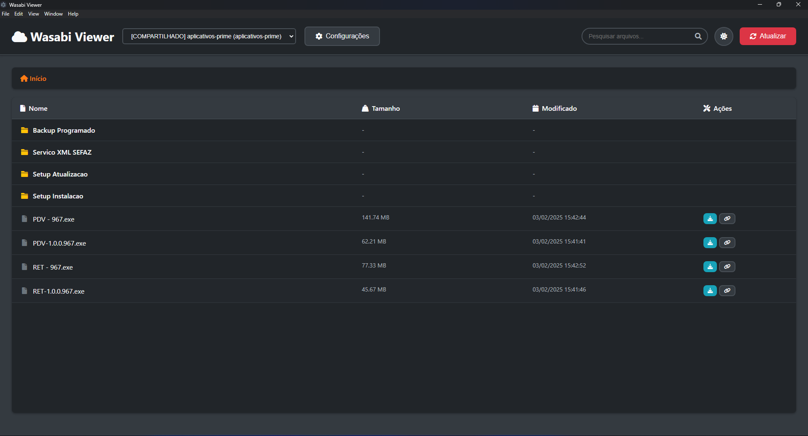

# Wasabi Viewer

Aplicativo desktop em Electron para visualizar e baixar arquivos de buckets Wasabi S3.



## Como usar

1. Instale as dependências:

   ```bash
   npm install
   ```

2. Execute em modo desenvolvimento:

   ```bash
   npm run dev
   ```

3. Para build/produção:

   ```bash
   npm run build
   ```

## Recursos principais

- Gerencie múltiplas conexões Wasabi S3
- Visualize, pesquise e baixe arquivos
- Geração de links temporários
- Compartilhamento seguro de acesso via token

## Configuração

- As credenciais e buckets são salvos localmente (não vão para o Git)
- Não compartilhe tokens ou credenciais publicamente
- **Importante:** Troque a chave de criptografia (`ENCRYPTION_KEY` em `main.js`) antes de usar em produção!

## Segurança

- Context isolation e preload habilitados
- Nenhuma credencial é exposta no código-fonte

## Estrutura

```
wasabi-viewer/
├── src/
│   ├── main.js        # Backend Electron
│   ├── preload.js     # Preload seguro
│   └── renderer/
│       ├── index.html
│       ├── renderer.js
│       └── styles.css
├── assets/
├── package.json
└── README.md
```

MIT License

## Publicar nova versão (release)

Siga este fluxo para gerar o instalador e subir a release no GitHub.

- Pré-requisitos
  - `Node.js` e `npm` instalados
  - `gh` (GitHub CLI) instalado e autenticado (`gh auth login` ou `GH_TOKEN` exportado)

- Gerar e publicar rapidamente com script `.sh`
  - Em ambientes com Bash (Git Bash/WSL/macOS/Linux):
    - `bash scripts/release.sh 1.0.10`
  - O script faz:
    - Atualiza `package.json` (`version` e `build.buildVersion`) para a versão fornecida
    - Executa `npm run dist` para gerar o instalador NSIS
    - Cria a release `v<versão>` se não existir
    - Faz upload de `dist/setups/<versão>/Wasabi Viewer Setup <versão>.exe` para a release
    - Exibe a URL da release ao final

- Comandos manuais (PowerShell/Windows)
  - Atualize a versão:
    - `node -e "const fs=require('fs'); const p='package.json'; const v='1.0.10'; const pkg=JSON.parse(fs.readFileSync(p,'utf8')); pkg.version=v; pkg.build=pkg.build||{}; pkg.build.buildVersion=v; fs.writeFileSync(p, JSON.stringify(pkg,null,2)+'\n');"`
  - Build do instalador:
    - `npm run dist`
  - Criar/atualizar release e enviar asset:
    - `& "C:\\Program Files\\GitHub CLI\\gh.exe" release view v1.0.10 --repo dioguera012/wasabi-viewer || & "C:\\Program Files\\GitHub CLI\\gh.exe" release create v1.0.10 --repo dioguera012/wasabi-viewer --title "Wasabi Viewer 1.0.10" --notes "Release 1.0.10"`
    - `& "C:\\Program Files\\GitHub CLI\\gh.exe" release upload v1.0.10 "dist\\setups\\1.0.10\\Wasabi Viewer Setup 1.0.10.exe" --repo dioguera012/wasabi-viewer --clobber`
    - `& "C:\\Program Files\\GitHub CLI\\gh.exe" release view v1.0.10 --repo dioguera012/wasabi-viewer --web`

- Dica: autenticação não-interativa
  - Exporte um `GH_TOKEN` com escopo `repo` para evitar prompts:
    - Bash: `export GH_TOKEN=seu_token_aqui`
    - PowerShell: `$env:GH_TOKEN="seu_token_aqui"`

- Onde encontrar o instalador gerado
  - `dist/setups/<versão>/Wasabi Viewer Setup <versão>.exe`
